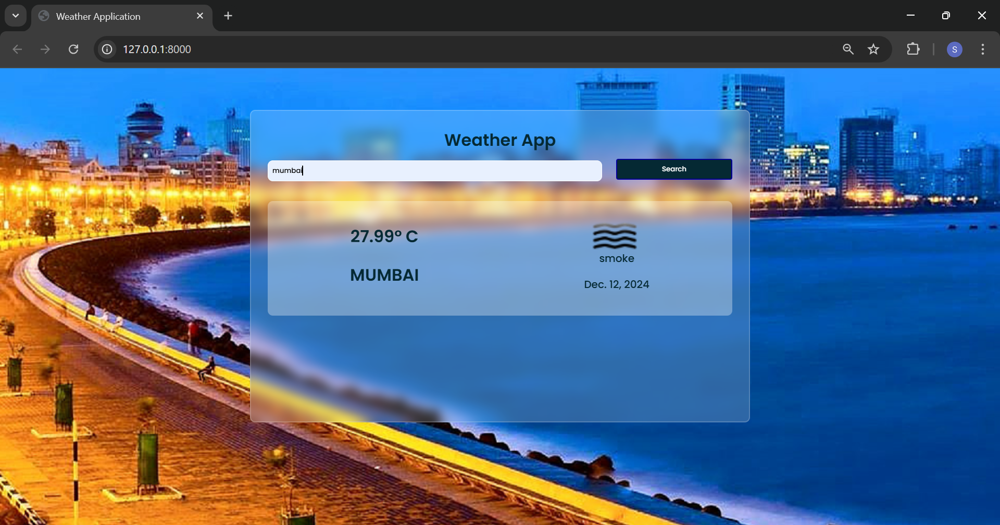
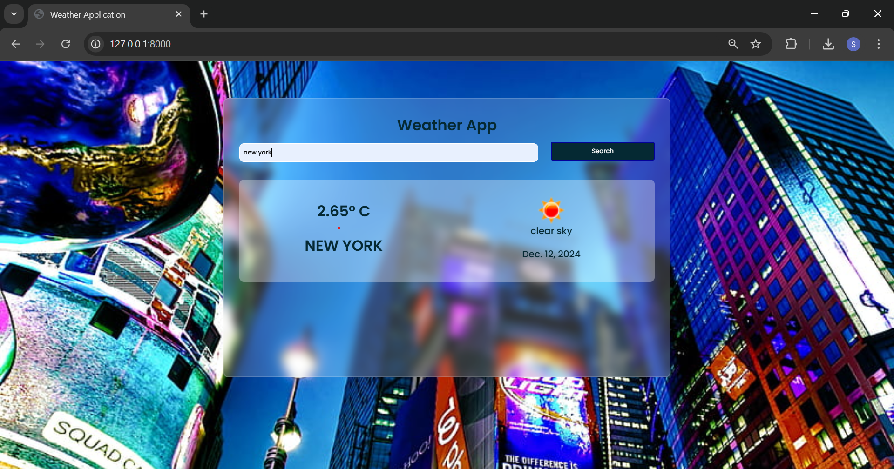

# 🌦️ Weather App

A **Django-based Weather App** that fetches and displays **real-time weather data** for any city using the OpenWeatherMap API. Stay updated with temperature, humidity, wind speed, and general weather conditions—all in a simple, sleek interface! 🌍

---

## 🚀 Features

- 🔍 Search for weather by **city name**
- 🌡️ View **temperature**, **humidity**, **wind speed**, and **weather condition**
- 📱 **Responsive**, user-friendly interface
- ⚠️ Error handling for invalid city names or network issues
- 🚀 Optional **API response caching** for better performance

---

## 🛠️ Installation Guide

Get the app up and running on your local machine in a few simple steps:

### ✅ Prerequisites

- 🐍 Python 3.8+
- 🌐 Django 4.0+
- 🔑 API Keys:
  - [OpenWeatherMap API Key](https://openweathermap.org/)
  - [Google Custom Search API Key](https://developers.google.com/custom-search)

### 📦 Setup Steps

1. **Clone the Repository**:
   ```bash
   git clone https://github.com/SimranShaikh20/WeatherApplication
   cd Weather-App

---

## How to Get a Weather API Key

1. Go to the [OpenWeatherMap API](https://openweathermap.org/api) website.
2. Sign up for a free account if you don’t already have one.
3. After logging in, navigate to the **API Keys** section of your profile.
4. Generate a new API key or use the default one provided.
5. Copy the API key and add it to the `.env` file as:
   ```env
   WEATHER_API_KEY=your_api_key_here
   ```

---

🔐 Getting API Keys
🌦️ Weather API (OpenWeatherMap)

1. Go to the [Google Custom Search API](https://developers.google.com/custom-search) website.
2. Sign in with your Google account.
3. Navigate to the **Get Started** section and enable the Custom Search JSON API.
4. Create a new search engine and configure it as per your requirements.
5. Copy the API key provided in the **Credentials** section.
6. Add the API key to your `.env` file as:
   ```env
   SEARCH_ENGINE_API_KEY=your_search_engine_api_key_here
   ```

## Usage

1. Enter the city name in the search bar.
2. Press the "Search" button.
3. View the weather details for the entered city.

---

## Project Structure


```
Weather-App/
├── weather_app/        # Main Django app containing settings and URLs
├── templates/          # HTML templates for the app
├── static/             # CSS, JavaScript, and image files
├── .env                # Environment variables file
├── manage.py           # Django management script
├── requirements.txt    # Python dependencies
└── README.md           # Project documentation
```

---

🔎 Google Custom Search API

The app uses the [OpenWeatherMap API](https://openweathermap.org/api) to fetch weather data. Make sure to generate an API key and add it to your `.env` file as described in the installation steps.

### Example API Request
```bash
GET https://api.openweathermap.org/data/2.5/weather?q=city_name&appid=your_api_key
```

---

## Screenshots

### Home Page


### Weather Details


---

## Contributing

1. Fork the repository.
2. Create a feature branch:
   ```bash
   git checkout -b feature-name
   ```
3. Commit your changes:
   ```bash
   git commit -m "Add your message here"
   ```
4. Push to the branch:
   ```bash
   git push origin feature-name
   ```
5. Create a Pull Request.

---

---

## Acknowledgments

- [Django Documentation](https://docs.djangoproject.com/)
- [OpenWeatherMap API](https://openweathermap.org/api)
